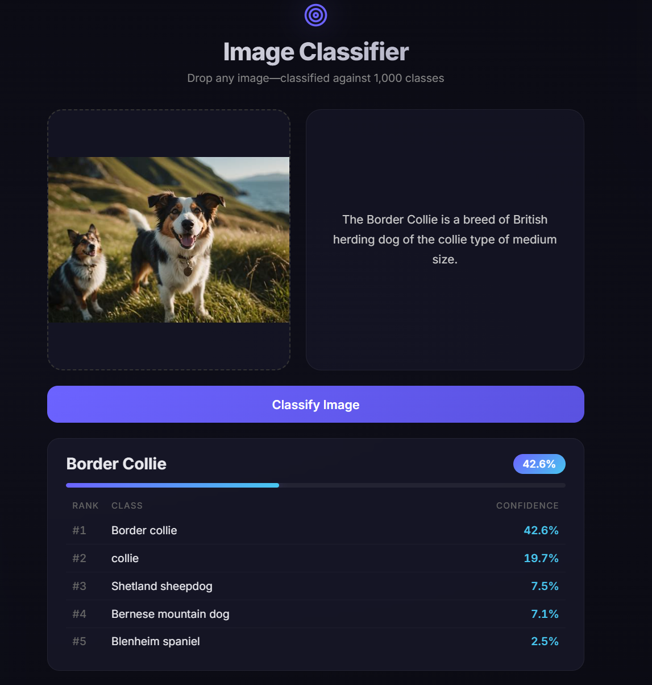
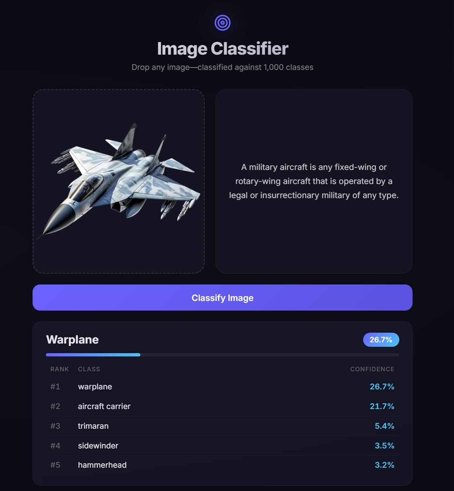
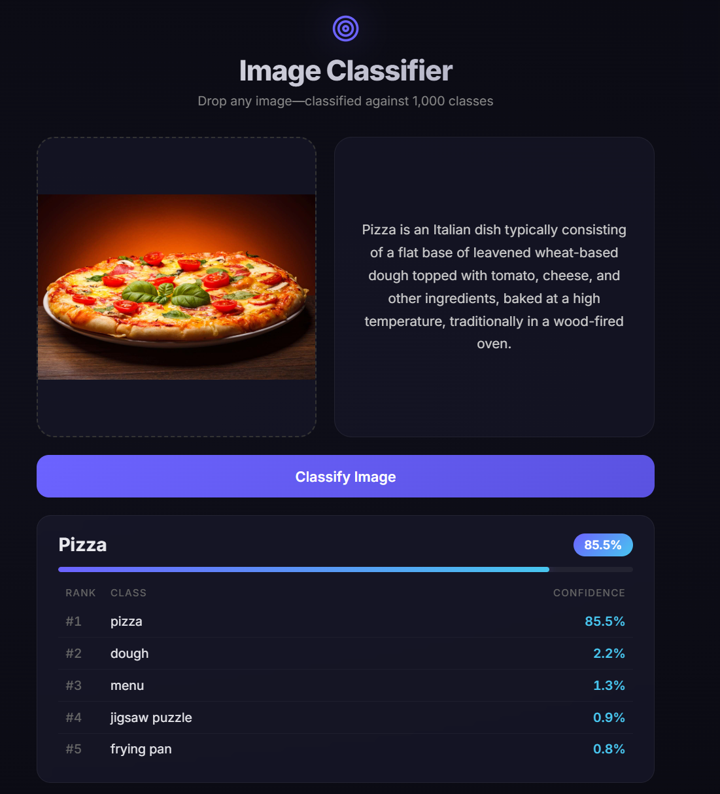

# Image Classifier

A web-based image classification system that leverages **OpenAI CLIP** to perform **zero-shot image recognition** across the **1,000 ImageNet categories**. Upload an image and receive the most probable classification, confidence score, top predictions, and contextual information sourced from Wikipedia.

CLIP's multimodal architecture enables semantic understanding of both images and text, allowing accurate classification without task-specific training.

---

## Overview

### Inference Pipeline

```text
Image Upload → CLIP Feature Extraction → Similarity Scoring Against 1,000 ImageNet Labels → Top Prediction Selection → Confidence Estimation → Wikipedia Metadata Retrieval
```

The system returns:

* Predicted class label
* Confidence score
* Wikipedia summary (when available)
* Top-5 ranked predictions

---

## Prerequisites

Before running the application, ensure the following dependencies are installed:

* **Python 3.10+** — https://www.python.org/downloads/
* **Node.js 18+** — https://nodejs.org/
* Terminal environment (Command Prompt, PowerShell, Bash, or equivalent)

---

## Getting Started

### 1. Clone the Repository

```bash
git clone https://github.com/SamTheDJ/clip-image-classifier.git
cd image-classifier
```

Alternatively, download and extract the project archive.

---

### 2. Launch the Backend Service

```bash
cd backend
pip install -r requirements.txt
uvicorn main:app --reload --port 8000
```

A successful startup will display:

```text
INFO:     Uvicorn running on http://0.0.0.0:8000
```


---

### 3. Launch the Frontend Application

Open a second terminal session and run:

```bash
cd frontend
npm install
npm start
```

The React development server will start and open:

```text
http://localhost:3000
```

If the browser does not launch automatically, navigate to the URL manually.

---

### 4. Classify an Image

1. Upload an image via drag-and-drop or file selection
2. Click **Classify Image**
3. Wait for inference to complete
4. Review:

   * Predicted label
   * Confidence score
   * Wikipedia description
   * Top-5 predictions

Typical inference time ranges from **2–5 seconds**, depending on hardware.

---

## Screenshots

<div align="center">
  
  <h3>Dog image classified as a Border Collie.</h3>
</div>

<br/>

<div align="center">
  
  <h3>Fighter jet correctly identified as a warplane.</h3>
</div>

<br/>

<div align="center">
  
  <h3>Baked pizza classified with high confidence score.</h3>
</div>

---

## Supported Categories

The model evaluates images against all **1,000 ImageNet classes**, including but not limited to:

`dog`, `cat`, `car`, `butterfly`, `bird`, `horse`, `fish`, `pizza`, `sunflower`, `bicycle`, `airplane`, `boat`, `laptop`, `keyboard`, `monitor`, `speaker`, `coffee mug`, `backpack`, `castle`, `bridge`, `waterfall`, `volcano`, `tiger`, `penguin`, `turtle`, and hundreds more.

### Performance Notes

Best results are typically achieved on:

* Consumer products
* Animals and wildlife
* Vehicles
* Food items
* Everyday objects
* Natural scenes

Performance may be less reliable for:

* Medical imagery (X-rays, MRIs, CT scans)
* Highly abstract artwork
* Domain-specific industrial content
* Extremely rare or niche object classes

---

## Project Structure

```text
image-classifier/
├── backend/
│   ├── main.py              ← FastAPI server (API endpoints)
│   ├── model.py             ← CLIP AI model (classifies images)
│   ├── imagenet_labels.py   ← List of 1,000 classes
│   └── requirements.txt     ← Python packages to install
├── frontend/
│   ├── public/              ← HTML template
│   ├── src/
│   │   ├── App.js           ← Main React app
│   │   ├── App.css          ← Styles
│   │   └── api.js           ← Connects frontend to backend
│   └── package.json         ← Node packages
├── .gitignore
└── README.md                ← This file
```

---


## Technology Stack

### Backend

* Python
* FastAPI
* PyTorch
* Hugging Face Transformers
* OpenAI CLIP

### Frontend

* React
* Axios

### External Services

* Wikipedia REST API (entity descriptions)

### Foundation Model

**Model:** `openai/clip-vit-base-patch32`

A pre-trained multimodal vision-language model capable of zero-shot image classification through semantic similarity matching between image and text embeddings.
